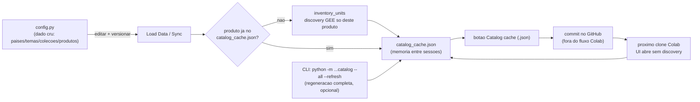
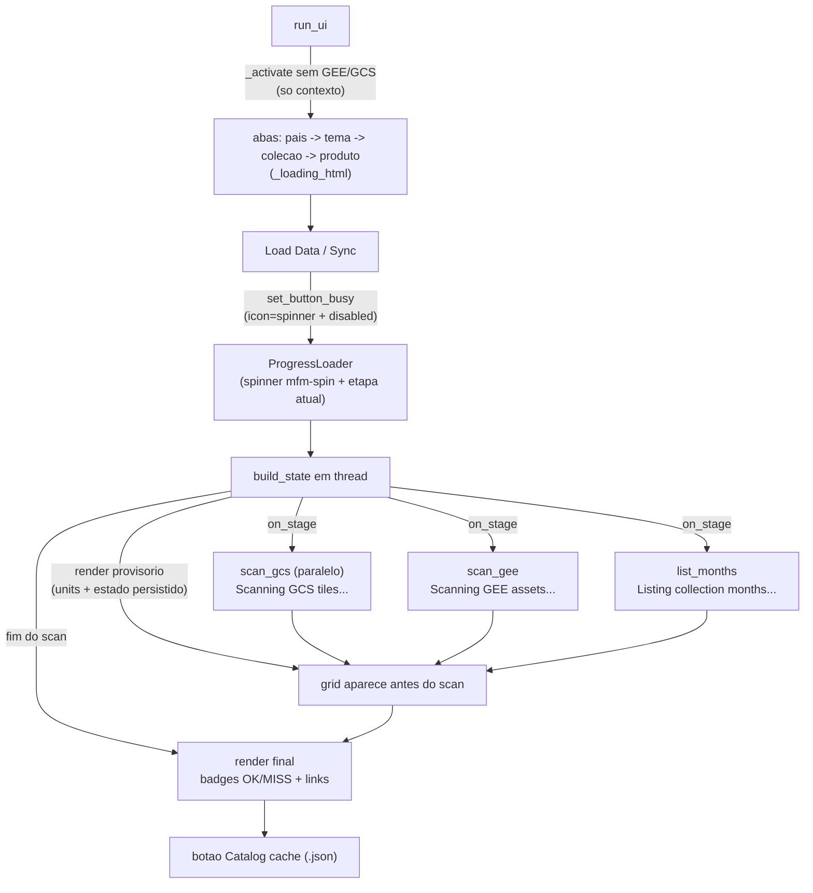

# Export & Vectorization — Monitor do Fogo

Pipeline de 7 etapas para processar os mapas mensais de area queimada do Monitor
do Fogo (multipais): exportacao do GEE, mosaico, vetorizacao, publicacao no GEE,
publicacao no bucket publico e limpeza do temp.

> ⚠️ **Fluxo beta/experimental**: o catalogo (`config.OBJ`) NAO inclui todos os
> dados do MapBiomas — e um subconjunto validado. Valide os resultados em escopo
> reduzido antes de escalar o processamento.

## Abrir no Google Colab

Os notebooks rodam direto no Colab a partir desta `main` (sem clone manual):

[](https://colab.research.google.com/github/mapbiomas/brazil-fire/blob/main/mapbiomas_fire_monitor/version_01/export_and_vectorization/mapbiomas_directlink_all_initiatives.ipynb)
**`mapbiomas_directlink_all_initiatives.ipynb`** — todas as iniciativas/temas (`THEMES = []`)

[](https://colab.research.google.com/github/mapbiomas/brazil-fire/blob/main/mapbiomas_fire_monitor/version_01/export_and_vectorization/mapbiomas_fire_monitor_brazil.ipynb)
**`mapbiomas_fire_monitor_brazil.ipynb`** — somente fogo (`THEMES = ["fire"]`)

> O link segue o padrao
> `https://colab.research.google.com/github/mapbiomas/brazil-fire/blob/main/<caminho>/notebook.ipynb`.

## Estrutura

```
export_and_vectorization/
├── README.md
├── mapbiomas_directlink_all_initiatives.ipynb   ← notebook multi-iniciativa (Colab)
├── mapbiomas_fire_monitor_brazil.ipynb          ← notebook focado em fogo (Colab)
├── config.py                             ← configuracao multipais (paths derivados)
├── state.py                              ← cache e scan GCS/GEE
├── export.py                             ← GEE → GCS tiles (Byte 0/1)
├── mosaic.py                             ← gdalbuildvrt + gdal_translate
├── vectorize.py                          ← gdal_polygonize + zip + upload GEE
├── publish.py                            ← sync bucket publico + limpeza temp
└── ui.py                                 ← UI interativa (grid + pipeline)
```

> **Onde fica o catalogo (`config.py`)** — no Colab, apos o clone, o pacote esta em
> `/content/brazil-fire/mapbiomas_fire_monitor/version_01/export_and_vectorization/`.
> Para versionar somente esse arquivo, edite-o direto no GitHub:
> https://github.com/mapbiomas/brazil-fire/blob/main/mapbiomas_fire_monitor/version_01/export_and_vectorization/config.py

## Como usar

1. Abra um dos notebooks no Google Colab pelos badges da secao acima.
2. Execute a celula 1 para instalar dependencias.
3. Execute a celula 2 para autenticar no GCP e Google Earth Engine.
4. Na celula de config, defina `COUNTRIES` (códigos do OBJ, ex.: `["brasil", "indonesia"]`).
5. Execute a celula da UI para abrir a navegação.
6. **Navegue**: país → tema (ex.: `fire`) → coleção (ex.: `monitor`, `collection4`) → **produto**.
7. No produto, clique em **Load Data** para descobrir as **unidades** (bandas p/
   imagem multibanda; imagens p/ ImageCollection) e depois marque as desejadas.
8. Clique em **Sincronizar** e processe as etapas pendentes (o sync roda em
   segundo plano com indicador de progresso; o kernel nao bloqueia).
9. Para versionar a memoria do catalogo (quando novos dados forem adicionados ao
   `config.py`), use o botao **`⤓ Catalog cache (.json)`** na barra inferior.

> **Células recolhíveis:** todas as células de código comecam com `#@title`
> (ex.: `#@title Etapa 1: Export`). No Colab, o título vira um cabeçalho
> clicável que recolhe/expande o codigo — o texto de introducao permanece visivel.

## Navegação (pais → tema → colecao → produto)

A Interface abre a árvore `pais → tema → colecao → produto` (guias até coleção +
dropdown de produto). Cada produto tem sua **grid de unidades**: para imagem
**multibanda**, uma linha por banda (ex.: `fire_frequency_1985_2025`); para
**ImageCollection**, uma linha por imagem (ex.: `2024_07`).

As celulas de processamento (Export/Mosaico/Vetorizacao/Upload/Publicar) sempre
atuam no **produto ativo + unidades selecionadas**.

```python
COUNTRIES = ["brasil", "indonesia"]   # codigos do OBJ (abas de pais na UI)
```

## Configuracao (OBJ)

A fonte de verdade e o `config.OBJ`: `OBJ[pais][tema][colecao] = [produtos]`, onde
cada produto tem `product` (nome curto), `assetid` (asset GEE de origem), `type`
(`byte`/`int16`/`float32` — dtype do mosaico), `vectorize` (vetorizacao/upload GEE,
apenas `annual_burned`) e `visible`.
Novas colecoes entram **editando o arquivo catalogo `config.py`** (veja secao
abaixo — o form "Adicionar coleção" foi descontinuado); os helpers
`config.add_collection` / `set_product_visible` / `remove_collection` seguem
disponiveis para uso programatico.

## Adicionando novos dados (edite e versione o `config.py`)

Como o catalogo e um subconjunto validado (fluxo **beta/experimental**), novos
dados devem entrar com cuidado:

1. **Prefira editar o `config.py` localmente e versionar a mudanca** (commit/PR
   neste repo) — assim a nova colecao/produto fica permanente para toda a equipe.
2. O form **"Adicionar coleção"** da UI foi **descontinuado** — a via oficial de
   entrada de dados e editar o `config.py` e versionar a mudanca.
3. Siga o schema de produto: `product`, `assetid`, `type` (`byte`/`int16`/`float32`),
   `vectorize`, `visible`.
4. **Valide antes de escalar**: rode primeiro 1 pais/1 mes, confira COG, vetor e
   link publico — so depois amplie o escopo.

## Memoria do catalogo (catalog_cache.json)

`config.py` e o **dado cru** (paises/temas/colecoes/produtos). O
`catalog_cache.json` e a **memoria persistente entre sessoes**: guarda as
unidades/bandas descobertas no GEE, para a UI abrir sem discovery a cada sessao.

- **Preenchimento sob demanda**: bandas/imagens sao descobertas apenas no
  **Load Data/Sync**, produto a produto — o cache nao e "enchido" com dados que
  voce nao carregou.
- **Download**: o botao **`⤓ Catalog cache (.json)`** (barra inferior, ao lado do
  log) baixa o JSON com tudo que foi carregado na sessao. No Colab ele dispara o
  download; fora dele, salva localmente e imprime o caminho.
- **Versionamento**: quando novos dados forem adicionados ao `config.py`, rode o
  **Load Data** no produto, baixe o JSON pelo botao e suba-o no GitHub
  (`export_and_vectorization/catalog_cache.json`) — as proximas sessoes abrem sem
  discovery. O arquivo e versionado (nao esta mais no `.gitignore`).
- **CLI (regeneracao completa, opcional)**: `python -m
  export_and_vectorization.catalog --all --refresh` re-descobre todos os paises e
  salva o cache.

### Celulas descontinuadas nos notebooks

- **Add Collection**: descontinuada. Novos dados entram editando e versionando o
  catalogo `config.py` (veja "Adicionando novos dados").
- **Input Data Catalog** e **Reset Local State**: removidas dos notebooks. O
  catalogo e o proprio `config.py`; o estado local e reconstruido no primeiro
  Load Data/Sync.
- **Diagnostics**: pausada. O plano e migrar o que for util dela (bandas, nodata,
  tamanho) para um painel dentro da interface — sem prazo definido.

## Colunas da grid (etapas)

As colunas seguem a ordem das etapas de cada produto. Produtos **vetorizáveis**
(apenas `annual_burned`) mostram as colunas de vetor; nos demais produtos essas
colunas ficam **ocultas**:

| Etapa | Coluna | Quando vira **OK** | Celula |
|-------|--------|--------------------|--------|
| 1 | Export | tiles no GCS (`temp/`) | Export |
| 2 | Mosaico | COG montado | Mosaico |
| 3 | Publico mosaico | COG espelhado no `mapbiomas-public` | Publicar mosaico |
| 4 | Vetor GCS *(só `annual_burned`)* | ZIP vetorial no GCS | Vetorizacao |
| 5 | Vetor GEE *(só `annual_burned`)* | FeatureCollection no GEE | Upload GEE |
| 6 | Publico vetor *(só `annual_burned`)* | ZIP espelhado no `mapbiomas-public` | Publicar vetor |
| 7 | Clean temp | tiles de `temp/` removidos apos consolidacao | Limpar temp |

Ordem sugerida — **Export → Mosaico → Publicar mosaico → Vetor GCS → Vetor GEE →
Publicar vetor → Clean temp** (para produtos nao-vetorizaveis: **Export → Mosaico →
Publicar mosaico → Clean temp**; o Clean temp e sempre a ultima etapa).

A legenda da grid traz a dica **MISS → OK** com a celula que resolve cada coluna.
O cabeçalho de cada coluna mostra o numero da **Etapa**.

## Links de download nos badges OK

Badges **OK** de algumas colunas viram links (apenas quando a etapa esta OK):

- **Mosaico** → baixa o COG: `https://storage.googleapis.com/mapbiomas-fire/{...}/monthly_burned-{country}_{Y}_{M}.tif`
- **Vetor GCS** → baixa o ZIP: `https://storage.googleapis.com/mapbiomas-fire/{...}/monthly_burned-{country}_{Y}_{M}.zip`
- **Vetor GEE** → clique copia o asset ID (`projects/mapbiomas-{country}/assets/FIRE/MONITOR/...`)
- **Publico mosaico** → baixa o COG do bucket publico: `https://storage.googleapis.com/mapbiomas-public/{...}`
- **Publico vetor** → baixa o ZIP do bucket publico: `https://storage.googleapis.com/mapbiomas-public/{...}`
- **Export** (tiles) e **Clean temp** ficam sem link.

Os buckets `mapbiomas-fire` e `mapbiomas-public` sao leitura publica (links diretos).

## Forcar reprocessamento (FORCE por etapa)

Por padrao, cada etapa **pula** (SKIP) as unidades que ja estao OK. Para refazer
uma etapa, ative a variavel `FORCE_<ETAPA>` na propria celula (default `False`):

| Etapa | Variavel | Com `True` |
|-------|----------|-----------|
| 1. Export | `FORCE_EXPORT` | exclui os tiles de `temp/` da unidade **antes** de exportar |
| 2. Mosaico | `FORCE_MOSAIC` | exclui o COG existente e remonta |
| 3. Publicar mosaico | `FORCE_PUBLISH_MOSAIC` | sobrescreve o COG no publico |
| 4. Vetorizacao *(só `annual_burned`)* | `FORCE_VECTOR` | exclui o ZIP existente e revetoriza |
| 5. Upload GEE *(só `annual_burned`)* | `FORCE_UPLOAD` | exclui o asset GEE existente e re-uploada |
| 6. Publicar vetor *(só `annual_burned`)* | `FORCE_PUBLISH_VECTOR` | sobrescreve o ZIP no publico |
| 7. Limpar temp | — | idempotente |

Para reprocessar uma unidade ja completa, selecione-a na grid e rode a etapa com a
`FORCE_<ETAPA> = True`.

## Visual

O UI é autossuficiente: todos os componentes tem **fundo e cores explicitos** de
alto contraste, entao fica legivel independente do tema do Colab. Badges **OK** de
download aparecem como **`🔗 OK`** (sublinhado com outline sutil).

O carregamento usa um **spinner padronizado** (CSS `mfm-spin`): durante o
Sync/Load Data o botao fica `icon=spinner` + `disabled` e o indicador de
progresso mostra a **etapa atual** do scan ("Scanning GCS tiles...", "Scanning
GEE assets...", "Listing collection months...") — o scan roda em segundo plano e
o kernel nao bloqueia. Os placeholders das abas usam o mesmo spinner.

## Log drawer

O painel de log foi otimizado para **nao custar processamento**:

- A aba **Log history** mantem em tela apenas as ultimas **500 linhas**
  (ring buffer) renderizadas em um unico widget, com atualizacao throttled —
  o DOM nao cresce com o volume de mensagens.
- O historico **completo da sessao** pode ser baixado a qualquer momento pelo
  botao **`⬇ Export log (.txt)`** (download direto no Colab; fora dele, salva
  o arquivo localmente e imprime o caminho).
- Por padrao, linhas por-unidade (`[DEBUG]`, `[FOUND]`, `[SKIP]`) ficam
  ocultas e cada etapa mostra um **sumario** final, ex.:
  `[MOSAIC] Done: 12 ok, 30 skipped, 0 failed (42 units)`.
- Para ver o detalhe unidade a unidade, ative no `config.py`:
  `LOG_VERBOSE = True`.
- Mensagens `[ERROR]`/`[WARN]` sempre aparecem imediatamente.

## Selecionar unidades especificas

- **Filtro por unidade**: o dropdown de unidade na UI restringe a grid as unidades
  do prefixo escolhido (ano para produtos anuais, `YYYY_MM` para mensais). Os
  botoes **Selecionar Pendentes** e **Selecionar Todos** valem apenas para as
  unidades visiveis no filtro.
- **Unidade por unidade**: marque/desmarque os checkboxes da grid normalmente.
- **Clear**: desmarca as selecoes do produto atualmente exibido.
- **Clear All**: desmarca as selecoes de **todos** os produtos/paises de uma vez.
- **Recomecar um periodo ("do zero")**: use a celula de LIMPEZA (descomentando os
  blocos) para apagar tiles / mosaicos / vetores ZIP de um intervalo de unidades e
  depois Sincronize — os meses voltam a aparecer como pendentes.

## Fluxo de processamento

```
GEE ImageCollection
       │
       ▼  [1] Export (export.py)  → tiles 0/1 .tif no GCS  .../{product}/temp/
       │
       ▼  [2] Mosaic (mosaic.py)  → COG 0/1 no GCS         .../{product}/
       │
       ▼  [3] Publish mosaic (publish.py) → COG no publico .../{product}/
       │
       ▼  [4] Vectorize (vectorize.py) → shapefile+unique_id → .zip   (só annual_burned)
       │                                    .../{raster}_vectors/
       │
       ▼  [5] Upload GEE (vectorize.py)                                  (só annual_burned)
       │         projects/mapbiomas-public/assets/{country}/fire/monitor/{raster}_vectors
       │
       ▼  [6] Publish vector (publish.py) → ZIP no publico .../{raster}_vectors/  (só annual_burned)
       │
       ▼  [7] Clean temp (publish.py) → apaga tiles temp/ dos meses consolidados
```

## Padrao de caminhos

**GCS (bucket de processamento):** `gs://{bucket}/initiatives/{country}/fire/monitor/{product}`

| Recurso | Path |
|---------|------|
| ImageCollection (origem) | `projects/mapbiomas-public/assets/{country}/fire/monitor/mapbiomas_fire_monthly_burned_v1` |
| Tiles GCS | `gs://mapbiomas-fire/initiatives/{country}/fire/monitor/mapbiomas_fire_monthly_burned_v1/temp/` |
| Mosaicos GCS | `gs://mapbiomas-fire/initiatives/{country}/fire/monitor/mapbiomas_fire_monthly_burned_v1/` |
| Vetores GCS (ZIP) | `gs://mapbiomas-fire/initiatives/{country}/fire/monitor/mapbiomas_fire_monthly_burned_v1_vectors/` |
| Vetores GEE | `projects/mapbiomas-public/assets/{country}/fire/monitor/mapbiomas_fire_monthly_burned_v1_vectors/` |
| Publico (espelho) | `gs://mapbiomas-public/initiatives/{country}/fire/monitor/...` |

Os vetores ficam numa **pasta irma do raster vetorizado**, com sufixo `_vectors`
— a MESMA regra no GCS e no GEE. O nome da pasta e o nome fisico do raster de
origem (ex.: `mapbiomas_fire_monthly_burned_v1` → `mapbiomas_fire_monthly_burned_v1_vectors`;
`mapbiomas_indonesia_fire_collection2_annual_burned_v1` → `..._annual_burned_v1_vectors`).
A Etapa 4 (Upload GEE) cria a pasta se nao existir e deixa **tudo publico**
(`all_users_can_read`): a ACL e aplicada na pasta (assets novos herdam) e,
opcionalmente, por asset via `make_vectors_public` (rodar apos as tasks do GEE
concluirem).

> **Migracao**: pastas antigas (`{product}_vectors_v01` no GEE; nome curto do
> produto nas colecoes do GCS) viraram legado — o Sync nao as enxerga.

Paises suportados: `brazil`, `indonesia`. Novos paises entram no dict `COUNTRIES`
em `config.py`.

## Convencoes de nomes

- Tiles: `fire_monitor_v1_monthly_burned_{country}_{YYYY}_{MM}XXXXXXXXXX-XXXXXXXXXX.tif`
- Mosaico: `monthly_burned-{country}_{YYYY}_{MM}.tif`
- Vetor (zip): `monthly_burned-{country}_{YYYY}_{MM}.zip`

## Export leve (Byte 0/1 + nodata no mosaico)

A exportacao grava tiles **Byte 0/1 puro** (sem `selfMask`, sem banda de mascara):
0 = sem fogo, 1 = fogo. Uma unica banda mantem os tiles leves.

O **mosaico** e gerado como **Byte 0/1 com `0 = nodata`** (`-a_nodata 0`) e
`COMPRESS=DEFLATE (ZLEVEL=9) + PREDICTOR=2`: tiles 100% oceano ficam quase de
graca via mascara interna do COG, e o DEFLATE comprime melhor que o LZW em dados
0/1 — resultado bem menor (ex.: Indonesia ~16-25 MB por mes, antes ~75 MB).

A vetorizacao usa `gdal_polygonize -mask` e ignora o pixel 0 (nodata) normalmente.

Para comparar codecs num mes real, rode o script
`python -m export_and_vectorization.benchmark_compression --country indonesia --year 2024 --month 7`
(LZW vs DEFLATE vs ZSTD; opcional `--blocksize`).

## Publicacao (etapas 3, 4 e 7)

`publish.py` expoe funcoes incrementais e idempotentes; com `ui=` informado,
todas iteram sobre os contextos afetados pela selecao multi-painel:

1. **`publish_mosaic_all(ui=...)`** — copia COGs (`.../{product}/*.tif`) para o bucket
   publico (valida tamanho apos a copia).
2. **`publish_vector_all(ui=...)`** — copia vetores ZIP (`.../{raster}_vectors/*.zip`)
   para o bucket publico (so produtos vetorizaveis).
3. **`cleanup_temp_selected(ui)`** — apaga os tiles de `temp/` das unidades
   **selecionadas na grid** (libera espaco; tiles eram o maior volume
   intermediario). Nao ha condicionais com as demais etapas: a ordem de
   execucao e apenas uma sugestao de fluxo. A delecao e restrita ao padrao de
   tiles em `temp/` — nunca alcanca COGs, ZIPs, bucket publico ou GEE.

`publish_all()` encadeia as duas publicacoes. Pode rodar periodicamente para pegar
as unidades que faltaram.

## Dependencias

- **GDAL**: `gdalbuildvrt`, `gdal_translate`, `gdal_polygonize.py`
- **Python**: `gcsfs`, `earthengine-api`, `geopandas`, `rasterio`, `psutil`, `ipywidgets`
- **Google Cloud**: autenticacao via `google.colab.auth`
- **Google Earth Engine**: autenticacao via `ee.Authenticate()`

## Dados ja processados

Unidades ja completas (as 7 etapas: export + mosaico + vetor GCS + vetor GEE +
publico mosaico + publico vetor + clean temp) aparecem como **OK** na interface
e sao ignorados durante o processamento. Apenas meses novos ou incompletos sao
processados. Como o COG so existe apos export+mosaico, meses com `temp/` ja
limpo continuam marcadas como export OK.

## Grafo de atualizacao

### Fluxo de dados / memoria do catalogo



### Carregamento da UI + spinners padronizados


